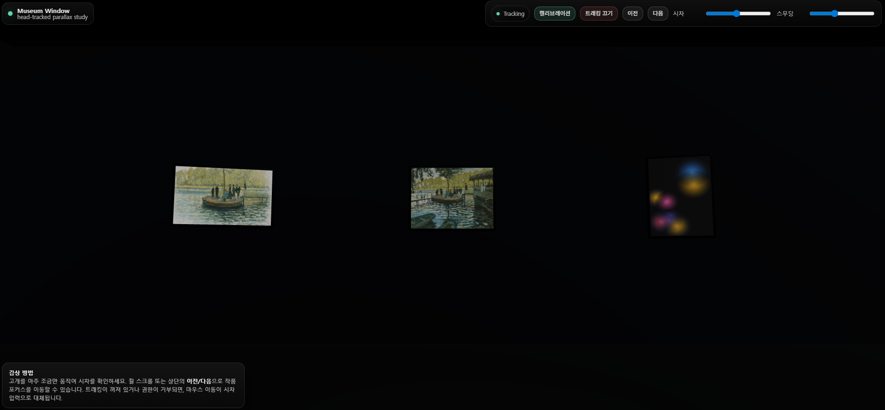
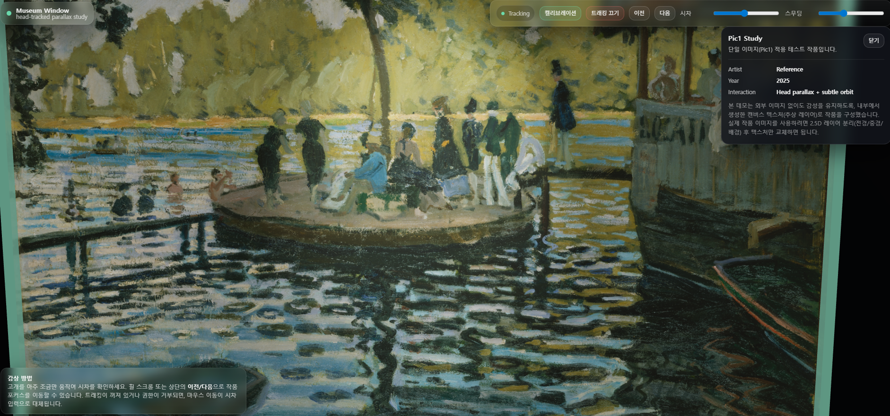

# 🖼️ MUSEUM PARALLAX

**Interactive parallax art gallery with head-tracked camera and cinematic zoom**

This project explores how subtle camera parallax and layered imagery can make digital art feel spatial and alive.  
By combining off-axis projection, head/mouse tracking, and cinematic camera transitions, the gallery feels like looking through a living window rather than a flat screen.

---

## ✨ Overview

A calm, museum-like virtual space where artworks subtly respond to the viewer’s position.  
Camera parallax is applied without breaking composition, maintaining a refined and non-game-like experience.

---

## 🔍 Inspect Mode

When an artwork is selected:
- The camera **smoothly zooms in** toward the piece  
- Only **very limited rotation** is allowed for close inspection  
- A soft spotlight enhances focus without overpowering the artwork  
- Closing returns the camera **cinematically** to its original position  

---

## 🧠 Key Features

- **Head / Mouse Tracked Parallax**  
  Off-axis projection shifts the camera frustum instead of moving the camera itself

- **2.5D Layered Artworks**  
  Background, midground, and foreground layers create depth through subtle parallax

- **Cinematic Camera Transitions**  
  Smooth zoom-in, lock, inspect, and return flow without abrupt cuts

- **Minimal Interaction Design**  
  No aggressive controls — interaction stays quiet and gallery-like

---

## 🛠️ Tech Stack

- **React**
- **Three.js**
- **@react-three/fiber / drei**
- **WebGL**
- **MediaPipe (Face Tracking)**
- Mouse fallback when camera access is unavailable

---

## 🎯 Motivation

Most 3D web experiences feel either flat or overly game-like.  
This project focuses on **restraint** — using just enough motion to enhance perception without distracting from the artwork itself.

---

## 📌 Notes

- All artworks are used for **non-commercial, experimental purposes**
- This repository serves as a **visual interaction study** and showcase prototype

---

## 🚀 Future Ideas

- Subtle normal-mapped highlights for foreground layers
- Ambient sound that reacts to camera proximity
- Automatic layer extraction experiments

---

